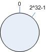
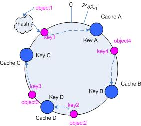
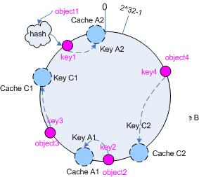

# ring-hash
implementation of consistent hash based on ring hash

## Build status

[](https://mrshuvava.visualstudio.com/ring-hash/_build/latest?definitionId=1)

## Usage

* install nuget ring-hash
* install nuget murmur3

```csharp
//arrange
public class Node {
    public string IPAdress {get;set; }
    public string ServerName {get;set;}

    public override string ToString()
    {
        return $"Node {ServerName}";
    }
}
var replicasCount = 5;
var rHash = new ConsistentHash<Node>(new Murmur32(), replicasCount)
//  act
rHash.AddNodes(new List<Node> { first, second });
var shard1 = rHash.GetShardHashForHash(44444);
```

## Consistent hashing

### Why you need consistent hashing

Now we will consider the common way to do load balance. The machine number chosen to cache object o will be:

```js
hash(o) mod n
```

Here, n is the total number of cache machines. While this works well until you add or remove cache machines:

When you add a cache machine, then object o will be cached into the machine:
```js
hash(o) mod (n+1)
```

When you remove a cache machine, then object o will be cached into the machine:

```js
hash(o) mod (n-1)
```

So you can see that almost all objects will hashed into a new location. This will be a disaster since the originating content servers are swamped with requests from the cache machines. And this is why you need consistent hashing.

Consistent hashing can guarantee that when a cache machine is removed, only the objects cached in it will be rehashed; when a new cache machine is added, only a fairly few objects will be rehashed.

Now we will go into consistent hashing step by step

### Hash space

Commonly, a hash function will map a value into a 32-bit key, 0~2^<sup>32</sup>-1. Now imagine mapping the range into a circle, then the key will be wrapped, and 0 will be followed by 2^32-1, as illustrated in figure 1.



### Map object into hash space

Now consider four objects: object1~object4. We use a hash function to get their key values and map them into the circle, as illustrated in figure 2.


```js
hash(object1) = key1;
.....
hash(object4) = key4;
```

### Map the cache into hash space

The basic idea of consistent hashing is to map the cache and objects into the same hash space using the same hash function.

Now consider we have three caches, A, B and C, and then the mapping result will look like in figure 3.

```js
hash(cache A) = key A;
....
hash(cache C) = key C;
```


### Map objects into cache

Now all the caches and objects are hashed into the same space, so we can determine how to map objects into caches. Take object obj for example, just start from where obj is and head clockwise on the ring until you find a server. If that server is down, you go to the next one, and so forth. See figure 3 above.

According to the method, object1 will be cached into cache A; object2 and object3 will be cached into cache C, and object4 will be cached into cache B.

### Add or remove cache

Now consider the two scenarios, a cache is down and removed; and a new cache is added.

If cache B is removed, then only the objects that cached in B will be rehashed and moved to C; in the example, see object4 illustrated in figure 4.


If a new cache D is added, and D is hashed between object2 and object3 in the ring, then only the objects that are between D and B will be rehashed; in the example, see object2, illustrated in figure 5.



### Virtual nodes

It is possible to have a very non-uniform distribution of objects between caches if you don't deploy enough caches. The solution is to introduce the idea of "virtual nodes".

Virtual nodes are replicas of cache points in the circle, each real cache corresponds to several virtual nodes in the circle; whenever we add a cache, actually, we create a number of virtual nodes in the circle for it; and when a cache is removed, we remove all its virtual nodes from the circle.

Consider the above example. There are two caches A and C in the system, and now we introduce virtual nodes, and the replica is 2, then three will be 4 virtual nodes. Cache A1 and cache A2 represent cache A; cache C1 and cache C2 represent cache C, illustrated as in figure 6.



Then, the map from object to the virtual node will be:

```js
objec1->cache A2; objec2->cache A1; objec3->cache C1; objec4->cache C2
```


When you get the virtual node, you get the cache, as in the above figure.

So object1 and object2 are cached into cache A, and object3 and object4 are cached into cache. The result is more balanced now.

So now you know what consistent hashing is.

description was taken from [original](https://www.codeproject.com/Articles/56138/Consistent-hashing)